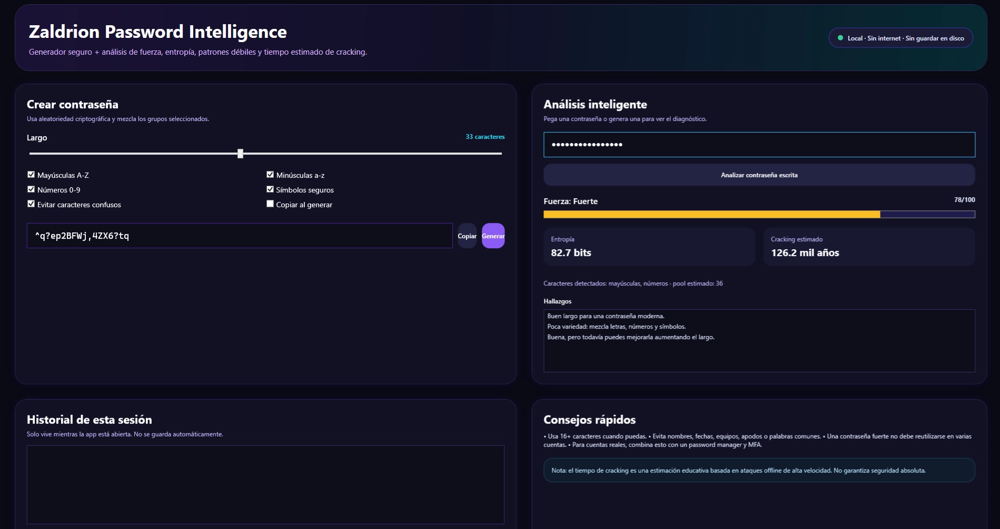

# 🧠 Zaldrion Password Intelligence

Modern Windows application for generating secure passwords and performing real-time password strength analysis — fully local, private, and offline.


---

## 📦 Version

**v1.0.0**

---

## ✨ Features

- 🔐 Cryptographically secure password generation (`RandomNumberGenerator`)
- 🎚️ Adjustable length (8–64 characters)
- ✅ Customizable character sets:
  - Uppercase (A–Z)
  - Lowercase (a–z)
  - Numbers (0–9)
  - Symbols
- 👁️ Avoid ambiguous characters (`0`, `O`, `1`, `I`, `l`)
- 📊 Strength score (0–100)
- 🧮 Entropy calculation (bits)
- ⏱️ Estimated offline cracking time
- ⚠️ Weak pattern detection:
  - short passwords
  - repeated characters or patterns
  - common sequences
  - only letters or only numbers
- 📋 Clipboard copy
- 🧾 Session-only history (not saved)
- 💾 Optional `.txt` export
- 🌙 Modern dark UI (cybersecurity style)

---

## 🔒 Security Model

This application is designed with **privacy as a core principle**:

- Runs **100% locally**
- ❌ No internet connection required
- ❌ No data collection
- ❌ No cloud storage
- ❌ No external API usage
- Passwords never leave your machine

---

## 🖥️ Usage

Download the latest release, extract the ZIP file, and run:

```
ZaldrionPasswordIntelligence.exe
```

No installation or additional software is required.

---

## 🛠️ Development

### Requirements

- Windows 10/11  
- .NET 9 SDK  

### Run locally

```
dotnet run --project src/ZaldrionPasswordIntelligence/ZaldrionPasswordIntelligence.csproj
```

### Build portable executable

```
dotnet publish src/ZaldrionPasswordIntelligence/ZaldrionPasswordIntelligence.csproj `
  -c Release `
  -r win-x64 `
  --self-contained true `
  /p:PublishSingleFile=true `
  -o publish/win-x64
```

---

## 📁 Structure

```
src/
  ZaldrionPasswordIntelligence/
    Assets/
    Models/
    Services/
    App.xaml
    MainWindow.xaml
```

---

## ⚠️ Notes

- Password history exists only during the session.  
- Exported `.txt` files are plain text.  
- Cracking time is an estimate for educational purposes.  
- For real accounts, use a password manager and multi-factor authentication.  

---

## 👤 Author

**Zaldrion**

---

## 📸 Screenshots




## 📄 License

MIT License
